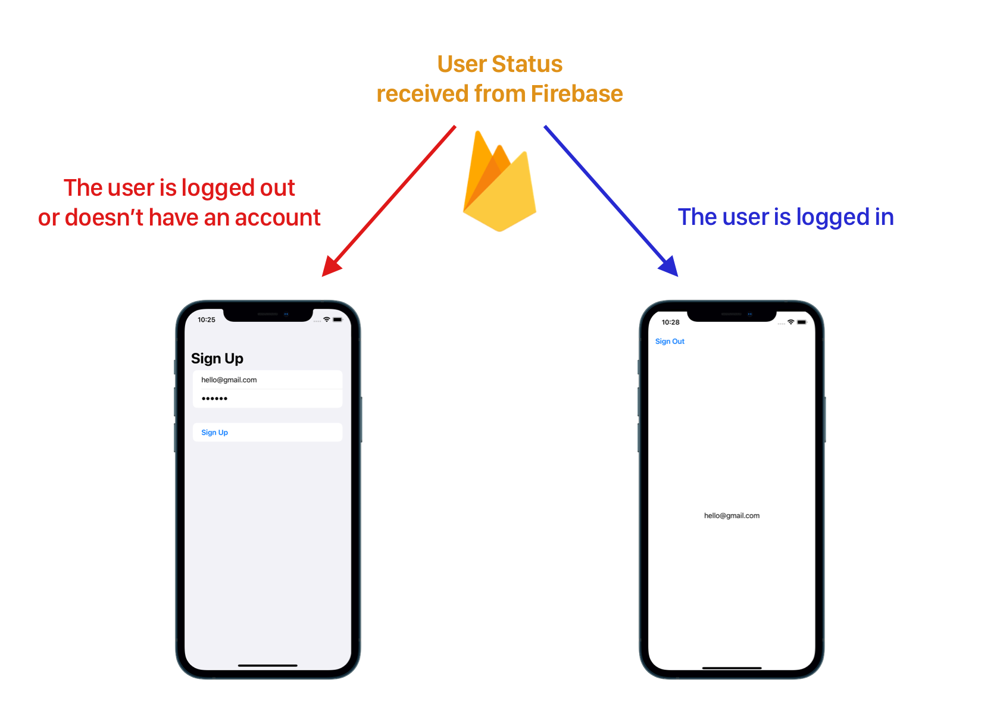

# FireLogin

A login flow using Firebase and SwiftUI to restrict access to authenticated users only.

## How to make it works:

Create a new project on the Firebase console.

Add an iOS to this project

Follow the 5 steps and don't forget to add the GoogleService-Info.plist file.

Set up Firebase authentication to receive user information

Run the Application

(SPM should fetch the packages itself).

## The logic implemented in this application: 

